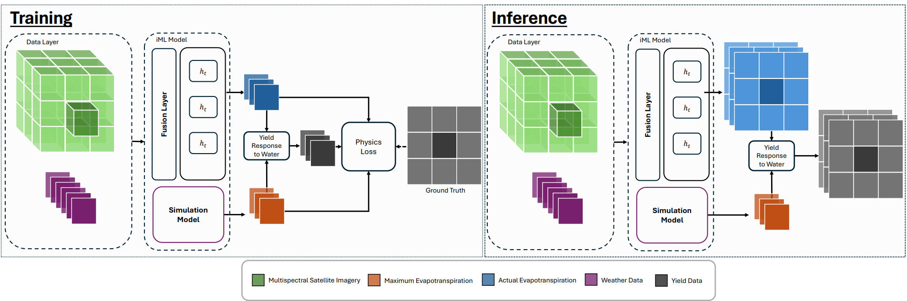
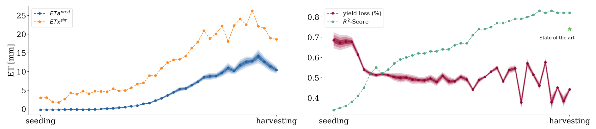

# Informed Learning for Estimating Drought Stress at Fine-Scale Resolution Enables Accurate Yield Prediction

## Overview
This repository is the implementation of the paper "Informed Learning for Estimating Drought Stress at Fine-Scale Resolution Enables Accurate Yield Prediction". The method is a physics-guided approach for crop yield loss forecasting at the pixel level using temporal estimations of the water use. 

The arxiv version of the paper can be found [here](https://arxiv.org/abs/2510.18648)

## Model Overview




## Pixel-Wise Yield Mapping 
The original yield data is collected from:
* Data source: [https://www.research-collection.ethz.ch/handle/20.500.11850/581023](https://www.research-collection.ethz.ch/handle/20.500.11850/581023)
* Reference: Perich, Gregor, et al. *Pixel-based yield mapping and prediction from Sentinel-2 using spectral indices and neural networks.* Field Crops Research 292 (2023): [108824](https://www.sciencedirect.com/science/article/pii/S0378429023000175?via%3Dihub#da0005).

Further, weather data was acquired for every field from the ERA5 archive. Simulation data was created using the [PyFAO56](https://github.com/kthorp/pyfao56). 
Further, the data preprocessed and stored in an xarray file. 

The data is stored in a xaaray dataset that can be downloaded [here](https://drive.google.com/file/d/1qcG0-Lnp7osuj6jdfbBKutF9obQynaHU/view?usp=drive_link)

## Execution example
* For training run
```
python train.py -s path/to/config/file.yaml
```

## Citation
```
@inproceedings{miranda2025informed, 
  author    = {Miranda, M. and Charfuelan, M. and Valdenegro-Toro, M. and Dengel, A.},
  title     = {Informed Learning for Estimating Drought Stress at Fine-Scale Resolution Enables Accurate Yield Prediction},
  booktitle = {Proceedings of the European Conference on Artificial Intelligence (ECAI 2025)},
  year      = {2025},
  note      = {Accepted for publication}
}
```
## Licence

This program is licenced under Attribution-NonCommercial 4.0 International agreement. 
You are free to share — copy and redistribute the material in any medium or format. You may adapt — remix, transform, and build upon the material.  
NonCommercial — You may not use the material for commercial purposes.  
Attribution — You must give appropriate credit , provide a link to the license, and indicate if changes were made . You may do so in any reasonable manner, but not in any way that suggests the licensor endorses you or your use. 

